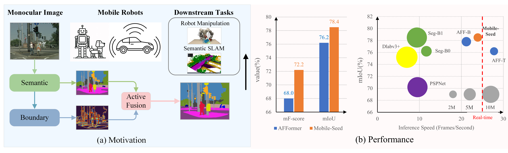

<h2> 
<a href="https://whu-usi3dv.github.io/Mobile-Seed/" target="_blank">MIE 1517 Group 10 Final Project: Enhancing Mobile Robot Perception in Urban Environments via Dual-Stream Encoder</a>
</h2>

This is the PyTorch implementation of our final prjoect:

> **Enhancing Mobile Robot Perception in Urban Environments via Dual-Stream Encoder**<br/>
> [Yang-Chen Lin](https://github.com/iolj-uoft), [Lucheng Zhou](), [Amirreza Azad](), [Nazib Chowdhury]()<br/>


## 🔭 Introduction
<p align="center">
<strong>TL;DR: This project is developed based on Mobile-Seed - an online framework for simultaneous semantic segmentation
and boundary detection on compact robots.</strong>
</p>


<p align="justify">
<strong>Abstract:</strong> Precise and rapid delineation of sharp boundaries
and robust semantics is essential for numerous downstream
robotic tasks, such as robot grasping and manipulation, realtime semantic mapping, and online sensor calibration performed on edge computing units. Although boundary detection
and semantic segmentation are complementary tasks, most
studies focus on lightweight models for semantic segmentation but overlook the critical role of boundary detection. In
this work, we introduce Mobile-Seed, a lightweight, dual-task
framework tailored for simultaneous semantic segmentation
and boundary detection. Our framework features a two-stream
encoder, an active fusion decoder (AFD) and a dual-task regularization approach. The encoder is divided into two pathways:
one captures category-aware semantic information, while the
other discerns boundaries from multi-scale features. The AFD
module dynamically adapts the fusion of semantic and boundary information by learning channel-wise relationships, allowing for precise weight assignment of each channel. Furthermore,
we introduce a regularization loss to mitigate the conflicts in
dual-task learning and deep diversity supervision. Compared to
existing methods, the proposed Mobile-Seed offers a lightweight
framework to simultaneously improve semantic segmentation
performance and accurately locate object boundaries. Experiments on the Cityscapes dataset have shown that Mobile-Seed
achieves notable improvement over the state-of-the-art (SOTA)
baseline by 2.2 percentage points (pp) in mIoU and 4.2 pp
in mF-score, while maintaining an online inference speed of
23.9 frames-per-second (FPS) with 1024×2048 resolution input
on an RTX 2080 Ti GPU. Additional experiments on CamVid
and PASCAL Context datasets confirm our method’s generalizability.
</p>

## 💻 Installation
The Mobile-Seed is built on [MMsegmentation](https://github.com/open-mmlab/mmsegmentation) 0.29.1. Please refer to the [installation](https://mmsegmentation.readthedocs.io/en/0.x/get_started.html#installation) page  for more details.

If you want to building from source, here is a quick installation example, the conda environment config file can be downloaded at [this link](https://drive.google.com/file/d/1GHaD-N2y_8_LrkpjTlrl6PdJNh44q4MV/view?usp=sharing) : 
```
git clone https://github.com/iolj-uoft/Mobile-Seed-MIE1517.git
conda env create -f environment.yml
conda activate mobileseed
mim install mmengine
mim install mmcv-full
cd Mobile-Seed
pip install -v -e .
```

## 🚅 Usage
### Evaluation
**NOTE: data preprocssing is not necessary for evaluation.**
We provide pre-trained models for Cityscapes, the files are all in the ```ckpt/``` folder.

Example: evaluate  ```Mobile-Seed``` on  ```Cityscapes```:
```
# Single-gpu testing
bash tools/evaluate_single_gpu.sh
```
### Training
Download weights of AFFormer pretrained on ImageNet-1K from [google-drive](https://drive.google.com/drive/folders/1Mru24qPdta9o8aLn1RwT8EapiQCih1Sw?usp=share_link) and put them in a folder like ```ckpt/```. On the Cityscapes dataset, we trained the Mobile-Seed with an Intel Core i7-12700KF CPU and a NVIDIA RTX 4070 Ti Super GPU for 160K iterations and cost approximately 26 hours.
Example: train ```Mobile-Seed``` on ```Cityscapes```:
```
# Single-gpu training
bash tools/dist_train.sh ./configs/Mobile_Seed/MS_tiny_cityscapes.py
```

### Data preprocessing
We provide processed Cityscapeson [onedrive](https://whueducn-my.sharepoint.com/:f:/g/personal/martin_liao_whu_edu_cn/EjklDmgVOitPrhuAwy6h6EkBPkyTvnlCkTN0BdjPIIc6xA?e=1i6D4Z) and [baidudisk](https://pan.baidu.com/s/1DD1LkEaTFUtabbJtTh_8iw?pwd=tpe4)(code: tpe4).
If you want to process the data from scratch, please refer to following steps:
#### Cityscapes
- Download the files gtFine_trainvaltest.zip, leftImg8bit_trainvaltest.zip and leftImg8bit_demoVideo.zip from the [Cityscapes website](https://www.cityscapes-dataset.com/) to data_orig/, and unzip them:
```
unzip data_orig/gtFine_trainvaltest.zip -d data_orig && rm data_orig/gtFine_trainvaltest.zip
unzip data_orig/leftImg8bit_trainvaltest.zip -d data_orig && rm data_orig/leftImg8bit_trainvaltest.zip
unzip data_orig/leftImg8bit_demoVideo.zip -d data_orig && rm data_orig/leftImg8bit_demoVideo.zip
```
- create training semantic label:
``
python data_preprocess/cityscapes_preprocess/code/createTrainIdLabelImgs.py <data_path>
``
- Generate .png training semantic boundary labels by running the following command:
```
# In Matlab Command Window
run code/demoPreproc_gen_png_label.m
```
This will create **instance-insensitive** semantic boundary labels for network training in ``data_proc_nis/``. For the difference between **instance-insensitive** and **instance-sensitive**, please refer to the [SEAL](https://openaccess.thecvf.com/content_ECCV_2018/papers/Zhiding_Yu_SEAL_A_Framework_ECCV_2018_paper.pdf).


## 🔦 Demo
Here is a demo script to test a single image. 
```
python demo/image_demo.py ${IMAGE_FILE} ${CONFIG_FILE} ${CHECKPOINT_FILE} ${SEG_FILE} \
[--out_sebound ${SEBOUND_FILE}] [--out_bibound ${BIBOUND_FILE}] [--device ${DEVICE_NAME}] [--palette-thr ${PALETTE}] 
```
Example: visualize the ```Mobile-Seed``` on  ```Cityscapes```:
```
python demo/image_demo.py demo/demo.png configs/Mobile_Seed/MS_tiny_cityscapes.py \
/path/to/checkpoint_file /path/to/outseg.png --device cuda:0 --palette cityscapes
```
Moreover, in our project, we performed the demo on a ```.ts``` file from dash cam, so this is another demo python script to test an entire video at once.
```
python tools/live_video_demo.py ${VIDEO_FILE} ${CONFIG_FILE} ${CHECKPOINT_FILE} ${OUTPUT_FILE} \
[--device ${DEVICE_NAME}] [--palette ${PALETTE}] [--prefix ${PREFIX}]
```
Example: Visualize our approach on Cityscapes with a Dash Cam Video:
```
python demo/video_demo.py data/dash_cam/Stockyards.ts \
configs/Mobile_Seed/MS_tiny_cityscapes.py \
ckpt/GCA.pth \
demo/Stockyards_gca.mp4 \
--device cuda:0 --palette cityscapes --prefix gca
```
This will save the segmented video output to:
```
demo/Stockyards_gca.mp4
```